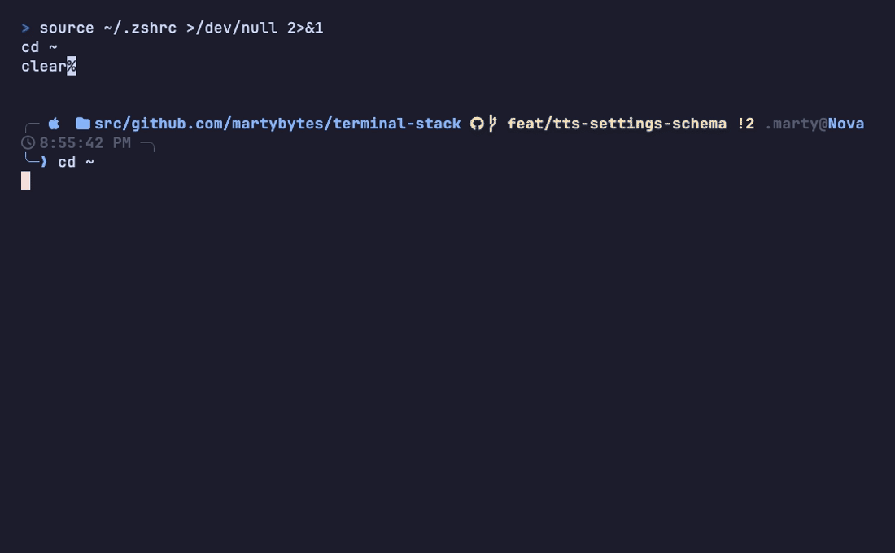

<h1 align="center">terminal-stack</h1>

<p align="center">
  <em>One terminal setup — WezTerm, tmux, Starship, zsh and PowerShell — deployed to Windows, WSL, native Linux and macOS from a single repo. Each platform gets the parts that make sense on it.</em>
</p>

<p align="center">
  <a href="https://github.com/martybytes/terminal-stack/actions/workflows/ci.yml"></a>
  <a href="LICENSE"></a>
  <a href="https://github.com/martybytes/terminal-stack/tags"></a>
  <a href="https://github.com/martybytes/terminal-stack/commits/main"></a>
</p>

<p align="center">
  <a href="#install">Install</a> ·
  <a href="#quickstart">Quickstart</a> ·
  <a href="ARCHITECTURE.md">Architecture</a> ·
  <a href="docs/kb/_index.md">Knowledge base</a> ·
  <a href="CHANGELOG.md">Changelog</a>
</p>

<p align="center">
  
</p>

<p align="center">
  
</p>

---

## What it is

Setting up a terminal takes an afternoon. Setting up **four** of them — a Windows
box, the Ubuntu inside it, a Linux server, a Mac — and keeping them the same
takes forever, and they drift anyway.

terminal-stack is one git repository that installs and configures all of them.
You answer a few questions once; every machine you run it on ends up with the
same prompt, the same keybindings, the same tools and the same shortcuts. When
you change something, you change it in one place and run one command.

It is built on [chezmoi](https://www.chezmoi.io/), and the interesting part is
that chezmoi only manages `$HOME` on the machine it runs on — so a Windows user
profile and the WSL home inside it are two different targets. This repo drives
both from a single `chezmoi apply`. [ARCHITECTURE.md](ARCHITECTURE.md) explains how.

- **Installs** a full terminal in one command per machine — WezTerm (or Ghostty on macOS), tmux, Starship, zsh, a Nerd Font, and a curated set of modern CLI tools. PowerShell 7 you bring yourself; the stack configures it.
- **Configures** everything from one source of truth, so the machines that share a feature share its settings exactly.
- **Remembers** your choices — leader key, theme, tools, voice — and keeps them across updates.
- **Updates** with `tstack update`, and **undoes** it with `tstack rollback`.
- **Diagnoses** itself with `tstack doctor` — the same checks on every platform, `--json` for scripts, and a named fix command on every failure.
- **Documents** itself: `doc` is a searchable knowledge base of runbooks, in your terminal.

> [!NOTE]
> This is a personal stack, published because the cross-platform mechanism is
> genuinely reusable. It is opinionated: it expects a fairly clean home
> directory, and it will manage `~/.zshrc` and your PowerShell `$PROFILE`
> outright — keep your own additions in `~/.zshrc.local` /
> `profile.local.ps1`, which it never touches. [INSTALL.md](INSTALL.md) has a
> step-by-step path if you want to inspect each change before applying it.

## Contents

- [Requirements](#requirements)
- [Install](#install)
- [Quickstart](#quickstart)
- [Demo](#demo)
- [Configuring](#configuring)
- [What you get](#what-you-get)
- [Architecture in 30 seconds](#architecture-in-30-seconds)
- [Development](#development)
- [Layout](#layout)
- [License](#license)

## Requirements

Pick your row. Everything in the third column is installed for you.

| Platform | You need first | The installer adds |
|---|---|---|
| **Windows 11** | winget (App Installer); PowerShell 7+ recommended | winget packages, `$PROFILE`, Nerd Font, Starship, and WezTerm if you keep it ticked |
| **WSL2 Ubuntu** | WSL2 with Ubuntu (run the Windows step first — see below) | apt packages, oh-my-zsh, chezmoi, Starship |
| **Debian / Ubuntu** | `sudo` and `curl` | the same shell stack (apt packages, oh-my-zsh, chezmoi, Starship); a desktop also gets WezTerm, but the WezTerm and Ghostty GUI configs are macOS/Windows-only |
| **macOS** | an admin account (Homebrew needs `sudo`; it is installed for you if absent) | brew formulae and casks, oh-my-zsh, chezmoi, Starship |

Docker is **optional**. It is only needed for the memory, compression, voice and
browser stacks under [`services/`](services/); everything else works without it.

## Install

### 1. Run the one-liner for your platform

Each installer is idempotent — safe to re-run. The macOS, WSL and Linux
one-liners end with `chezmoi apply`. The Windows one runs its own
`sync-windows.ps1` instead and hands off to the WSL step, which is where
`chezmoi apply` happens.

<details open>
<summary><b>macOS</b> (Apple Silicon or Intel)</summary>

```sh
curl -fsSL https://raw.githubusercontent.com/martybytes/terminal-stack/main/install-mac.sh | bash
```

Two System Settings toggles free `Ctrl+Space` and the F-row before the
keybindings work;
[INSTALL.md § Reopen WezTerm](INSTALL.md#4-reopen-wezterm) walks through them.
</details>

<details>
<summary><b>Windows 11</b> (PowerShell 7+)</summary>

```powershell
irm https://raw.githubusercontent.com/martybytes/terminal-stack/main/install.ps1 | iex
```

Run this **before** the WSL installer — the two share one clone, and only this
step installs the Windows-side packages (WezTerm, Starship, the Nerd Font).
</details>

<details>
<summary><b>WSL2 Ubuntu</b></summary>

```sh
curl -fsSL https://raw.githubusercontent.com/martybytes/terminal-stack/main/install-wsl.sh | bash
```

Detects your Windows username over interop and writes the shared configuration.
</details>

<details>
<summary><b>Debian / Ubuntu</b> (native, no WSL)</summary>

```sh
curl -fsSL https://raw.githubusercontent.com/martybytes/terminal-stack/main/install-linux.sh | bash
```

The Windows-sync hook self-no-ops here, so the same source tree is correct on a
headless server reached over SSH.
</details>

### 2. Answer the wizard

**The first question is how much of this you want**, and it opens by rendering
the prompt you would get:

| | what it installs |
|---|---|
| **just the prompt** | Starship and a Nerd Font. Your shell config, aliases and terminal are left alone |
| **prompt and terminal** | adds the managed zsh/tmux/WezTerm configs and the CLI tools |
| **the whole stack** | adds the agent wiring, the Docker services, voice notifications and memory |

Then: will you write code on this machine? That decides which half of the CLI
tool catalog is pre-ticked — a server wants monitors, disk and network tools; a
laptop wants runtimes, git tooling and the agent CLIs — and whether the agent
and memory questions are asked at all.

After that it is leader key, theme, terminal emulator and the tool picker. Every
menu marks its default and takes it on Enter; the single-choice menus accept an
option's name as well as its number, and the tick-lists take numbers plus `a`,
`n` and `s`. It ends with a review screen you can edit or abandon before any of
your choices are installed or saved — base prerequisites (Homebrew, git, the apt
base set) land before the questions.

Scripted installs skip each prompt with its own env var — `TS_PROFILE`,
`TS_DEVELOPMENT`, `TS_STARSHIP_PRESET`, `TS_LEADER`, `TS_THEME`,
`TS_TERMINALS`, `TS_APPS`, `TS_TMUX`, `TS_WEZ_MUX`, `TS_WEZ_RESTORE`,
`TS_ATUIN`, `TS_MEMORY_BACKEND`, `TS_CC_TTS`, `TS_HEADLESS` (bash only) — plus
`TS_ASSUME_YES=1` to accept the review. Full list in
[INSTALL.md § Scripted](INSTALL.md#scripted-fastest).

### 3. Verify

```sh
tstack doctor
```

Read-only, and exits non-zero if anything is wrong. Each failing check names the
command that fixes it; `tstack doctor --repair` points you at the interactive
cleanup checklist for clone relocation and leftover clones.

## Quickstart

```sh
tstack                 # every subcommand, with platform gaps marked
tstack --version       # clone path, branch, commit
tstack doctor          # diagnose the install; --json for one record per check, exit 1 if anything is wrong
tstack config          # interactive settings menu
tstack config theme follow
tstack ui              # every setting in one screen (needs Textual)
tstack wizard          # replay the install questionnaire
tstack ghostty         # the managed Ghostty config: status, diff, on, off
tstack update          # pull the latest stack and re-apply
tstack rollback        # undo that update
doc                    # fuzzy-find a runbook in the knowledge base
```

`tstack` and `doc` are shell functions the stack installs into `~/.zshrc` and
your PowerShell `$PROFILE`, so they exist only after an install.

Where things live:

| | Clone | Settings |
|---|---|---|
| **Windows + WSL** | `%LOCALAPPDATA%\terminal-stack\stack` (shared) | chezmoi `[data]` on the WSL side, mirrored to `%LOCALAPPDATA%\terminal-stack\config.json` (that mirror is the whole store only on a Windows-only install) |
| **Linux / macOS** | `~/.local/share/terminal-stack` | chezmoi `[data]` in `~/.config/chezmoi/chezmoi.toml` |

## Demo

The recording at the top is real output, not a mock-up.
[`docs/demo.tape`](docs/demo.tape) is the [Charm VHS](https://github.com/charmbracelet/vhs)
script that produced it:

```sh
brew install vhs ttyd ffmpeg
vhs docs/demo.tape
```

Every command in it is read-only. Re-record it after any change to
`tstack --help`, which is rendered from `tstack/commands.conf` and so changes
whenever the command surface does. It has to run on a machine where the stack is
installed: the tape drives the `tstack` shell function, which only exists after
an apply.

## Configuring

`tstack config` is the front door. Run it bare for a menu, or one-shot:

```sh
tstack config theme follow      # dark / light / follow the OS
tstack config prompt list       # every Starship prompt, rendered, then pick one
tstack agents llm               # which AgentMemory features a chat model switches on
tstack config leader ctrl-a     # the WezTerm leader key
tstack config apps              # re-open the CLI tool picker
tstack config tts on            # voice notifications
tstack config show              # the saved leader, theme, tmux prefix, apps and toggles
tstack config wizard            # replay the whole install questionnaire
```

`tstack ui` is the same settings in one screen — what each is now, what its
default is, and **which layer the value came from**, which is the thing a printed
value cannot tell you. `/` filters, `Space` cycles a choice, `d` restores the
default.

Where a setting's valid values are a fact about *this* machine rather than a
fixed list, `Enter` opens a picker instead of a text box: the voices your kokoro
actually serves (`s` plays one), the Starship presets your starship ships (each
one **rendered** in a preview pane), and the CLI tools as a tick-list.
AgentMemory's chat provider is editable there too, though it is not a saved
setting at all — it lives in the stack's `.env`.

It needs [Textual](https://textual.textualize.io/) (`uv tool install textual`),
the one third-party library this stack's Python uses.

Choices persist across updates. On a combined Windows + WSL machine, run
`tstack config` **from WSL** — its `chezmoi apply` is authoritative for the
Windows-side files too.

Other subcommands, each with `-h`:

| Command | What it does |
|---|---|
| `tstack services` | the Docker stacks under `services/` — up, down, status, test |
| `tstack mux` | whether WezTerm hosts panes in a mux server (off by default) |
| `tstack wezterm` | which WezTerm build you have, what is newer, switch channel |
| `tstack smb` | find, interrogate and mount SMB shares over rclone (macOS/Linux) |
| `tstack agents` | wires Headroom, Caveman and AgentMemory into this machine's Claude, Codex and Cursor |
| `tstack doc` | the knowledge base, same as the bare `doc` command |

## What you get

<details open>
<summary><b>Terminal and prompt</b></summary>

- **WezTerm** (nightly or stable, your pick) with a taller hand-drawn tab bar on Windows, WSL and macOS: the active tab is a solid accent block, each tab carries an index, an icon and a deliberately short title. Desktop Linux installs WezTerm but keeps its stock config. **Ghostty** is the macOS alternative — installed, with a managed `~/.config/ghostty/config`; Windows gets the same managed config at `%LOCALAPPDATA%\ghostty\`, and on Linux the installer points you at ghostty.org rather than installing it.
- **`F1`–`F4` are directions** — focus the pane that way, or split one into existence if none is there. `F5` jumps via a labelled overlay, `F6` swaps.
- **A no-timeout leader** (`Ctrl+Space` by default) drives splits and arrow-key repeatable modes for move, resize, rotate, tab-switch and font-size, each with an on-screen badge that auto-exits when idle. `Ctrl+Space p` fuzzy-picks a project from the `wso` tree (needs `fd`); `Ctrl+Space S`/`L` save and restore a session.
- **Starship prompt** on both zsh and PowerShell, with the palette baked to your theme.
- **tmux** configured for Claude Code passthrough, extended keys and mouse mode.
</details>

<details>
<summary><b>Command-line tools</b></summary>

- **The modern set**: eza, zoxide, fzf, bat, git-delta, ripgrep, fd, tree, glow, micro, Neovim.
- **Disk and monitoring**: duf, ncdu, dust and btop by default; gdu, bottom, glances, bandwhich and gping are one tick away in the picker.
- **Also in the catalog**: atuin — SQLite shell history, pre-ticked, and the wizard recommends letting it own `Ctrl+R` — plus yazi (file manager) and Zed, both unticked by default.
- **Runtimes**: `fnm` plus current Node LTS, and a Python group — Python itself, uv, pipx, ruff and ipython by default, with httpie, poetry and pre-commit a tick away.
- **Delta wired into git** through a managed gitconfig include — the installer adds one `include.path` line to your `~/.gitconfig` and owns nothing else in it. Because `--add` appends, the include resolves **last** and its settings win — six aliases, the delta pager, `pull.ff = only`, `help.autocorrect` — so put a setting of your own *below* that line if you want yours to.
</details>

<details>
<summary><b>Navigation</b></summary>

- **`ws`** jumps to your workspace root, autodetected per machine; **`wsp`** and **`wsw`** to its Personal and Work sibling roots.
- **`wso`** keeps every clone in one derivable tree, `<workspace>/<tier>/<host>/<owner>/<repo>` (`local/` when there is no remote), with the path computed from the repo's `origin` remote rather than the folder someone typed once — which is what catches a misfiled repo, the same remote cloned twice, or a clone pointing at a renamed account.
- **`lsr`** ranks directories by the newest mtime among their *immediate* children, so a project you edited inside all day sorts first — unlike `ls -lt`, which sorts by the directory's own mtime and buries it.
- **`db`** jumps to Dropbox, preferring Dropbox's own `info.json` — the only thing that gets a relocated folder or a Business account right — and falling back to the usual locations when it is unreadable.
</details>

<details>
<summary><b>Agent integrations</b> (optional)</summary>

- **Claude Code hooks** that drive the WezTerm tab state — per-pane dots, tab tint and fleet counts — and pin the tab title to the project while Claude runs.
- **A three-line Codex dashboard** for interactive sessions: location and git identity, changes and sync state, then live activity, model, context and usage bars.
- **Voice notifications** (opt-in) — a spoken line when an agent finishes, errors or needs you, via local Kokoro TTS, falling back through Chatterbox and edge-tts to the OS voice on macOS and Windows, so a stopped container does not mean silence. `ccmute` silences it instantly, with no apply.
- **One memory backend, chosen at install** — AgentMemory or Headroom, never both, because two stores means two half-filled ones with no way to tell which holds the answer.
</details>

<details>
<summary><b>The services those features need</b></summary>

`tstack services` drives Docker stacks that live in [`services/`](services/) —
agentmemory and its console, Headroom, Kokoro TTS and a Playwright MCP browser.
Nothing to clone separately.

`tstack services bootstrap` seeds every `.env`, generates secrets and creates
volumes; `tstack services test` takes it all down, brings it back up and proves
the chain works — that a memory can be written and read back, that Kokoro really
synthesises audio, and that every published port still binds `127.0.0.1`.
Everything it creates is named `ts-`, so `docker ps` separates it from your own
work at a glance.
</details>

## Architecture in 30 seconds

chezmoi manages `$HOME` on the machine it runs on. That covers WSL, Linux and
macOS. Most Windows-side files live in a `windows/` subdirectory that is
**excluded** from chezmoi's apply (`.chezmoiignore`), and a `run_after` hook
mirrors them to `C:\Users\<you>\` afterwards — substituting `__WIN_USER__` and
the saved leader/theme tokens on the way, splicing rather than overwriting the
two files another tool also writes (`~/.claude/settings.json`,
`~/.cursor/hooks.json`), and taking a dated backup of everything else. The same
hook also mirrors two trees chezmoi *does* apply to `$HOME`: `dot_codex/` to
`C:\Users\<you>\.codex\`, and `docs/kb/` to the Windows knowledge-base cache.

On native Linux and macOS that hook self-no-ops — there is no `/mnt/c` — so the
same source tree is correct on all four targets.

Single source of truth, single `chezmoi apply`, every target updated. The long
version is in [ARCHITECTURE.md](ARCHITECTURE.md); the design decisions and the
failures behind them are in [docs/decisions.md](docs/decisions.md).

## Development

The management layer is being ported from parallel bash + PowerShell
implementations to one Python program, `tstack`. The plan and its phases are in
[REVAMP-PLAN.md](REVAMP-PLAN.md); the rules for working on it are in
[AGENTS.md](AGENTS.md).

```sh
ruff check tstack tests
ruff format --check tstack
mypy
pytest tests/
```

`.githooks/pre-commit` runs those four; `pre-push` re-runs the suite with the
coverage floor (`--cov`, `fail_under = 81`) and adds the characterization
replay, once the clone has `core.hooksPath=.githooks` set.

```sh
tests/parity/run.sh        # the suite on Debian 13, Ubuntu 24.04, 22.04 and a bash 3.2 gate
```

CI ([`.github/workflows/ci.yml`](.github/workflows/ci.yml)) covers Ubuntu, macOS,
Windows and WSL, which is more than any single development machine can.
[docs/verifying-changes.md](docs/verifying-changes.md) covers the gates a runner
cannot perform — loading a WezTerm config without a GUI, driving an interactive
prompt through a pty, exercising a real config store.

## Layout

```
terminal-stack/
├── tstack/          the `tstack` command — one Python program, every platform
├── bootstrap/       per-OS bootstraps and the remaining shell backends
├── services/        Docker stacks (agentmemory, Headroom, Kokoro, Playwright)
├── docs/            architecture, decisions, and the `doc` knowledge base
├── tests/           pytest suite, characterization fixtures, parity containers
├── windows/         Windows-side files, synced by the run_after hook
├── dot_*            chezmoi-managed home files for WSL / Linux / macOS
├── install-*.sh     the one-liner installers (macOS, WSL, Linux)
└── install.ps1      the Windows one-liner installer
```

`bootstrap/`, `services/`, `tstack/`, `docs/` and `tests/` are all
chezmoi-ignored and run from the clone, so `tstack update` ships changes to them
without a home-directory apply. (On Windows the sync additionally mirrors
`docs/kb/` to `%LOCALAPPDATA%\terminal-stack\docs\kb` so `doc` picks up new
runbooks.)

## License

[MIT](LICENSE).
